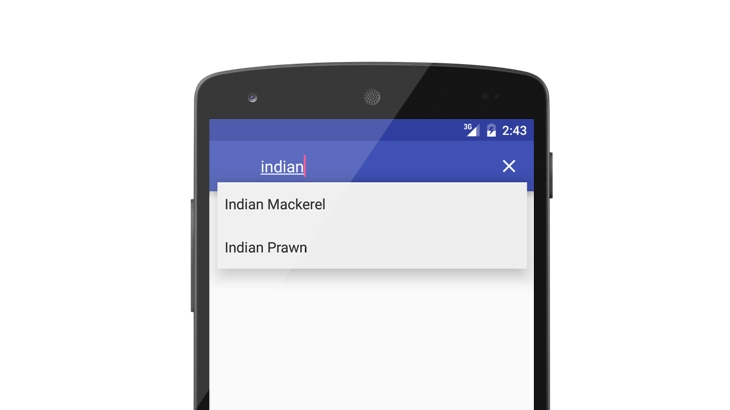

# Android AutoComplete Search Suggestions with PHP MySQL JSON

Filter the data loaded from PHP MySQL or JSON file in respond to user input and show them on autocomplete view as search suggestions. For tutorial  http://androidcss.com/android/android-autocomplete-search-suggestions/
